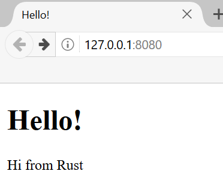

# Dự Án Cuối Cùng: Xây Dựng Một Web Server Đa Luồng

Đó là một hành trình dài, nhưng chúng ta đã đến phần cuối của cuốn sách. Trong
chương này, chúng ta sẽ cùng nhau xây dựng một dự án nữa để minh họa một số khái
niệm mà chúng ta đã học trong các chương cuối, cũng như ôn lại một số bài học
trước đó.

Đối với dự án cuối cùng, chúng ta sẽ tạo một máy chủ web hiển thị "hello" và
trông giống như Hình 21-1 trong trình duyệt web.

Hình 21-1: Dự án cuối cùng của chúng ta

Đây là kế hoạch của chúng ta để xây dựng máy chủ web:

1. Tìm hiểu một chút về TCP và HTTP.
2. Lắng nghe các kết nối TCP trên một socket.
3. Phân tích một số lượng nhỏ các yêu cầu HTTP.
4. Tạo một phản hồi HTTP phù hợp.
5. Cải thiện hiệu suất của máy chủ của chúng ta với một thread pool.

Trước khi chúng ta bắt đầu, chúng ta nên đề cập đến hai chi tiết. Thứ nhất,
phương pháp mà chúng ta sẽ sử dụng sẽ không phải là cách tốt nhất để xây dựng
một máy chủ web với Rust. Các thành viên cộng đồng đã xuất bản một số crate sẵn
sàng cho sản xuất có sẵn trên [crates.io](https://crates.io/) cung cấp các triển
khai máy chủ web và thread pool đầy đủ hơn so với những gì chúng ta sẽ xây dựng.
Tuy nhiên, mục đích của chúng ta trong chương này là giúp bạn học, không phải để
đi theo con đường dễ dàng. Bởi vì Rust là một ngôn ngữ lập trình hệ thống, chúng
ta có thể chọn mức độ trừu tượng mà chúng ta muốn làm việc và có thể đi đến mức
thấp hơn so với những gì có thể hoặc thực tế trong các ngôn ngữ khác.

Thứ hai, chúng ta sẽ không sử dụng async và await ở đây. Việc xây dựng một
thread pool đã là một thách thức đủ lớn, mà không cần thêm việc xây dựng một
runtime async! Tuy nhiên, chúng ta sẽ lưu ý cách async và await có thể áp dụng
cho một số vấn đề tương tự mà chúng ta sẽ thấy trong chương này. Cuối cùng, như
chúng ta đã lưu ý trong Chương 17, nhiều runtime async sử dụng thread pool để
quản lý công việc của chúng.

Do đó, chúng ta sẽ viết máy chủ HTTP cơ bản và thread pool thủ công để bạn có
thể học các ý tưởng và kỹ thuật chung đằng sau các crate mà bạn có thể sử dụng
trong tương lai.
